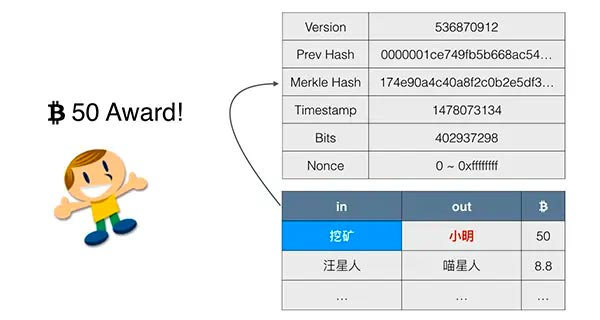
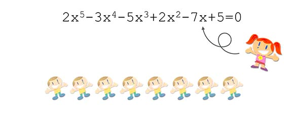
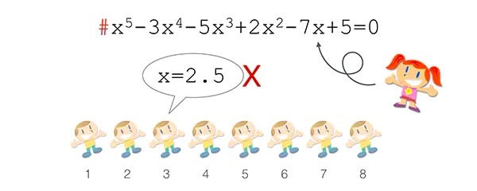
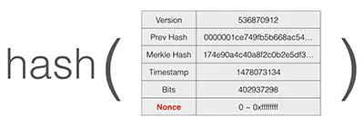
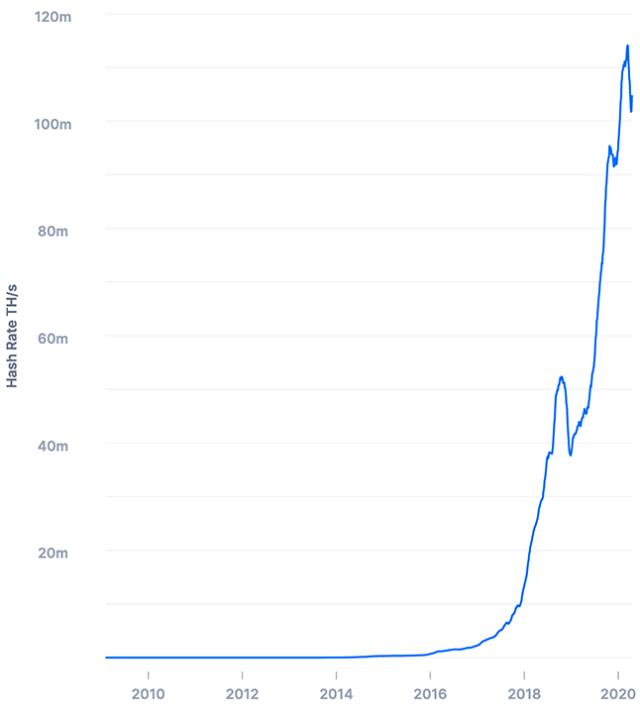
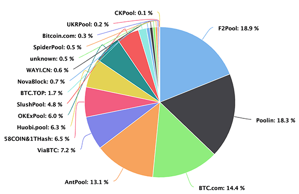

#### 挖矿原理

在比特币的P2P网络中，有一类节点，它们时刻不停地进行计算，试图把新的交易打包成新的区块并附加到区块链上，这类节点就是矿工。因为每打包一个新的区块，打包该区块的矿工就可以获得一笔比特币作为奖励。所以，打包新区块就被称为挖矿。

比特币的挖矿原理就是一种工作量证明机制。工作量证明POW是英文Proof of Work的缩写。

在讨论POW之前，我们先思考一个问题：在一个新区块中，凭什么是小明得到50个币的奖励，而不是小红或者小军？



当小明成功地打包了一个区块后，除了用户的交易，小明会在第一笔交易记录里写上一笔“挖矿”奖励的交易，从而给自己的地址添加50个比特币。为什么比特币的P2P网络会承认小明打包的区块，并且认可小明得到的区块奖励呢？

因为比特币的挖矿使用了工作量证明机制，小明的区块被认可，是因为他在打包区块的时候，做了一定的工作，而P2P网络的其他节点可以验证小明的工作量。

### 工作量证明

什么是工作量证明？工作量证明是指，证明自己做了一定的工作量。例如，在驾校学习了50个小时。而其他人可以简单地验证该工作量。例如，出示驾照，表示自己确实在驾校学习了一段时间：


比特币的工作量证明需要归结为计算机计算，也就是数学问题。如何构造一个数学问题来实现工作量证明？我们来看一个简单的例子。

假设某个学校的一个班里，只有一个女生叫小红，其他都是男生。每个男生都想约小红看电影，但是，能实现愿望的只能有一个男生。

到底选哪个男生呢？本着公平原则，小红需要考察每个男生的诚意，考察的方法是，出一道数学题，比如说解方程，谁第一个解出这个方程，谁就有资格陪小红看电影：



因为解高次方程没有固定的公式，需要进行大量的计算，才能算出正确的结果，这个计算过程就需要一定的工作量。假设小明率先计算出了结果x＝2.5，小红可以简单地验证这个结果是否正确：


可以看出，解方程很困难，但是，验证结果却比较简单。所以，一个有效的工作量证明在于：计算过程非常复杂，需要消耗一定的时间，但是，验证过程相对简单，几乎可以瞬间完成。

现在出现了另一个问题：如果其他人偷看了小明的答案并且抢答了怎么办？

要解决这个问题也很容易，小红可以按照男生的编号，给不同的男生发送不同的方程，方程的第一项的系数就是编号。这样，每个人要解的方程都是不一样的。小明解出的x＝2.5对于小军来说是无效的，因为小军的编号是3，用小明的结果验证小军的方程是无法通过验证的。



事实上如果某个方程被验证通过了，小红可以直接从方程的第一项系数得知是谁解出的方程。所以，窃取别人的工作量证明的结果是没有用的。

通过工作量证明，可以有效地验证每个人确实都必须花费一定时间做了计算。

在比特币网络中，矿工的挖矿也是一种工作量证明，但是，不能用解多项式方程来实现，因为解多项式方程对人来说很难计算，对计算机来说非常容易，可以在1秒钟以内完成。

要让计算机实现工作量证明，必须找到一种工作量算法，让计算机无法在短时间内算出来。这种算法就是哈希算法。

通过改变区块头部的一个`nonce`字段的值，计算机可以计算出不同的区块哈希值：



直到计算出某个特定的哈希值的时候，计算结束。这个哈希和其他的哈希相比，它的特点是前面有好几个0：

```
hash256(block data, nonce=0) = 291656f37cdcf493c4bb7b926e46fee5c14f9b76aff28f9d00f5cca0e54f376f
hash256(block data, nonce=1) = f7b2c15c4de7f482edee9e8db7287a6c5def1c99354108ef33947f34d891ea8d
hash256(block data, nonce=2) = b6eebc5faa4c44d9f5232631f39ddf4211443d819208da110229b644d2a99e12
hash256(block data, nonce=3) = 00aeaaf01166a93a2217fe01021395b066dd3a81daffcd16626c308c644c5246
hash256(block data, nonce=4) = 26d33671119c9180594a91a2f1f0eb08bdd0b595e3724050acb68703dc99f9b5
hash256(block data, nonce=5) = 4e8a3dcab619a7ce5c68e8f4abdc49f98de1a71e58f0ce9a0d95e024cce7c81a
hash256(block data, nonce=6) = 185f634d50b17eba93b260a911ba6dbe9427b72f74f8248774930c0d8588c193
hash256(block data, nonce=7) = 09b19f3d32e3e5771bddc5f0e1ee3c1bac1ba4a85e7b2cc30833a120e41272ed
...
hash256(block data, nonce=124709132) = 00000000fba7277ef31c8ecd1f3fef071cf993485fe5eab08e4f7647f47be95c
```

比特币挖矿的工作量证明原理就是，不断尝试计算区块的哈希，直到计算出一个特定的哈希值，它比难度值要小。

比特币使用的SHA-256算法可以看作对随机输入产生随机输出，例如，我们对字符串`Hello`再加上一个数字计算两次SHA-256，根据数字的不同，得到的哈希是完全无规律的256位随机数：

```
hash256("Hello?") = ????????????????????????????????????????????????????????????????
```

大约计算16次，我们可以在得到的哈希中找到首位是`0`的哈希值，因为首位是0出现的概率是1/16：

```
hash256("Hello1") = ffb7a43d629d363026b3309586233ab7ffc1054c4f56f43a92f0054870e7ddc9
hash256("Hello2") = e085bf19353eb3bd1021661a17cee97181b0b369d8e16c10ffb7b01287a77173
hash256("Hello3") = c5061965d37b8ed989529bf42eaf8a90c28fa00c3853c7eec586aa8b3922d404
hash256("Hello4") = 42c3104987afc18677179a4a1a984dbfc77e183b414bc6efb00c43b41b213537
hash256("Hello5") = 652dcd7b75d499bcdc61d0c4eda96012e3830557de01426da5b01e214b95cd7a
hash256("Hello6") = 4cc0fbe28abb820085f390d66880ece06297d74d13a6ddbbab3b664582a7a582
hash256("Hello7") = c3eef05b531b56e79ca38e5f46e6c04f21b0078212a1d8c3500aa38366d9786d
hash256("Hello8") = cf17d3f38036206cfce464cdcb44d9ccea3f005b7059cff1322c0dd8bf398830
hash256("Hello9") = 1f22981824c821d4e83246e71f207d0e49ad57755889874d43def42af693a077
hash256("Hello10") = 8a1e475d67cfbcea4bcf72d1eee65f15680515f65294c68b203725a9113fa6bf
hash256("Hello11") = 769987b3833f082e31476db0f645f60635fa774d2b92bf0bab00e0a539a2dede
hash256("Hello12") = c2acd1bb160b1d1e66d769a403e596b174ffab9a39aa7c44d1e670feaa67ab2d
hash256("Hello13") = dab8b9746f1c0bcf5750e0d878fc17940db446638a477070cf8dca8c3643618a
hash256("Hello14") = 51a575773fccbb5278929c08e788c1ce87e5f44ab356b8760776fd816357f6ff
hash256("Hello15") = 0442e1c38b810f5d3c022fc2820b1d7999149460b83dc680abdebc9c7bd65cae
```

如果我们要找出前两位是`0`的哈希值，理论上需要计算256次，因为`00`出现的概率是16^2=256，实际计算44次：

```
hash256("Hello44") = 00e477f95283a544ffac7a8efc7decb887f5c073e0f3b43b3797b5dafabb49b5
```

如果我们要找出前3位是`0`的哈希值，理论上需要计算16^3=4096次，实际计算6591次：

```
hash256("Hello6591") = 0008a883dacb7094d6da1a6cefc6e7cbc13635d024ac15152c4eadba7af8d11c
```

如果我们要找出前4位是`0`的哈希值，理论上需要计算16^4=6万5千多次，实际计算6万7千多次：

```
hash256("Hello67859") = 00002e4af0b80d706ae749d22247d91d9b1c2e91547d888e5e7a91bcc0982b87
```

如果我们要找出前5位是`0`的哈希值，理论上需要计算16^5=104万次，实际计算158万次：

```
hash256("Hello1580969") = 00000ca640d95329f965bde016b866e75a3e29e1971cf55ffd1344cdb457930e
```

如果我们要找出前6位是`0`的哈希值，理论上需要计算16^6=1677万次，实际计算1558万次：

```
hash256("Hello15583041") = 0000009becc5cf8c9e6ba81b1968575a1d15a93112d3bd67f4546f6172ef7e76
```

对于给定难度的SHA-256：假设我们用难度1表示必须算出首位1个`0`，难度2表示必须算出首位两个`0`，难度N表示必须算出首位N个`0`，那么，每增加一个难度，计算量将增加16倍。

对于比特币挖矿来说，就是先给定一个难度值，然后不断变换`nonce`，计算Block Hash，直到找到一个比给定难度值低的Block Hash，就算成功挖矿。

我们用简化的方法来说明难度，例如，必须计算出连续17个`0`开头的哈希值，矿工先确定Prev Hash，Merkle Hash，Timestamp，bits，然后，不断变化`nonce`来计算哈希，直到找出连续17个`0`开头的哈希值。我们可以大致推算一下，17个十六进制的`0`相当于计算了1617次，大约需要计算2.9万亿亿次。

```
17个0 = 1617 = 295147905179352825856 = 2.9万亿亿次
```

实际的难度是根据`bits`由一个公式计算出来，比特币协议要求计算出的区块的哈希值比难度值要小，这个区块才算有效：

```
Difficulty = 402937298
           = 0x18 0455d2
           = 0x0455d2 * 28 * (0x18 - 3)
           = 106299667504289830835845558415962632664710558339861315584
           = 0x00000000000000000455d2000000000000000000000000000000000000000000
```

注意，难度值的数值越小，说明哈希值前面的`0`越多，计算的难度越大。

比特币网络的难度是不断变化的，它的难度保证大约每10分钟产生一个区块，而难度值在每2015个区块调整一次：如果区块平均生成时间小于10分钟，说明全网算力增加，难度也会增加，如果区块平均生成时间大于10分钟，说明全网算力减少，难度也会减少。因此，难度随着全网算力的增减会动态调整。

 比特币设计时本来打算每2016个区块调整一次难度，也就是两周一次，但是由于第一版代码的一个bug，实际调整周期是2015个区块。

根据比特币每个区块的难度值和产出时间，就可以推算出整个比特币网络的全网算力。

比特币网络的全网算力一直在迅速增加。目前，全网算力已经超过了100EH/每秒，也就是大约每秒钟计算1万亿亿次哈希：



所以比特币的工作量证明被通俗地称之为挖矿。在同一时间，所有矿工都在努力计算下一个区块的哈希。而挖矿难度取决于全网总算力的百分比。举个例子，假设小明拥有全网总算力的百分之一，那么他挖到下一个区块的可能性就是1%，或者说，每挖出100个区块，大约有1个就是小明挖的。

由于目前全网算力超过了100EH/s，而单机CPU算力不过几M，GPU算力也不过1G，所以，单机挖矿的成功率几乎等于0。比特币挖矿已经从早期的CPU、GPU发展到专用的ASIC芯片构建的矿池挖矿。



当某个矿工成功找到特定哈希的新区块后，他会立刻向全网广播该区块。其他矿工在收到新区块后，会对新区块进行验证，如果有效，就把它添加到区块链的尾部。同时说明，在本轮工作量证明的竞争中，这个矿工胜出，而其他矿工都失败了。失败的矿工会抛弃自己当前正在计算还没有算完的区块，转而开始计算下一个区块，进行下一轮工作量证明的竞争。

为什么区块可以安全广播？因为Merkle Hash锁定了该区块的所有交易，而该区块的第一个coinbase交易输出地址是该矿工地址。每个矿工在挖矿时产生的区块数据都是不同的，所以无法窃取别人的工作量。

比特币总量被限制为约2100万个比特币，初始挖矿奖励为每个区块50个比特币，以后每4年减半。

### 共识算法

如果两个矿工在同一时间各自找到了有效区块，注意，这两个区块是不同的，因为coinbase交易不同，所以Merkle  Hash不同，区块哈希也不同。但它们只要符合难度值，就都是有效的。这个时候，网络上的其他矿工应该接收哪个区块并添加到区块链的末尾呢？答案是，都有可能。

通常，矿工接收先收到的有效区块，由于P2P网络广播的顺序是不确定的，不同的矿工先收到的区块是有可能的不同的。这个时候，我们说区块发生了分叉：


在分叉的情况下，有的矿工在绿色的分叉上继续挖矿，有的矿工在蓝色的分叉上继续挖矿：


但是最终，总有一个分叉首先挖到后续区块，这个时候，由于比特币网络采用最长分叉的共识算法，绿色分叉胜出，蓝色分叉被废弃，整个网络上的所有矿工又会继续在最长的链上继续挖矿。

由于区块链虽然最终会保持数据一致，但是，一个交易可能被打包到一个后续被孤立的区块中。所以，要确认一个交易被永久记录到区块链中，需要对交易进行确认。如果后续的区块被追加到区块链上，实际上就会对原有的交易进行确认，因为链越长，修改的难度越大。一般来说，经过6个区块确认的交易几乎是不可能被修改的。


### 小结

比特币挖矿是一种带经济激励的工作量证明机制；

工作量证明保证了修改区块链需要极高的成本，从而使得区块链的不可篡改特性得到保护；

比特币的网络安全实际上就是依靠强大的算力保障的。