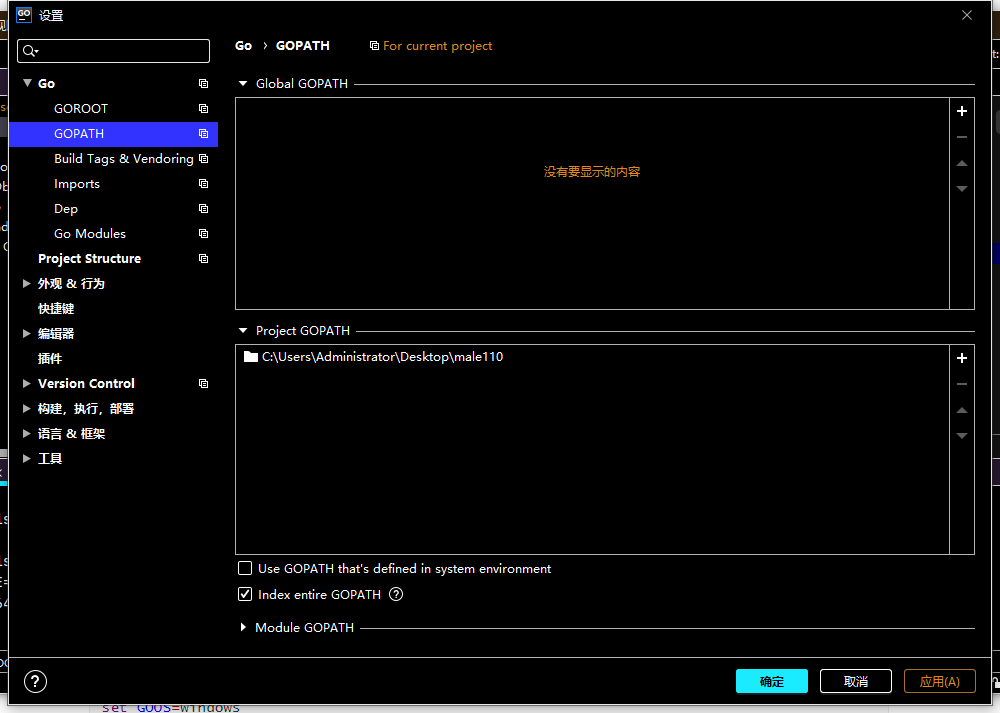
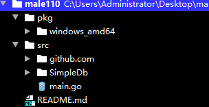

### 配置

### 1.本地机器

>本地机器不安装GoLang SDK,即使安装了，Goland也不引用全局gopath
>
>新建一个project时，设置project gopath
>
>同时选上 index entire gopath
>
>

### 2. GO ENV设置

```bash
go env -w KEY=VALUE
```

* GO111MODULE=auto
* GOPROXY=https://goproxy.cn,direct

```bash
set GO111MODULE=auto
set GOARCH=amd64
set GOBIN=
set GOCACHE=C:\Users\Administrator\AppData\Local\go-build
set GOENV=C:\Users\Administrator\AppData\Roaming\go\env
set GOEXE=.exe
set GOFLAGS=
set GOHOSTARCH=amd64
set GOHOSTOS=windows
set GOINSECURE=
set GOMODCACHE=C:\Users\Administrator\Desktop\male110\pkg\mod
set GONOPROXY=
set GONOSUMDB=
set GOOS=windows
set GOPATH=C:\Users\Administrator\Desktop\male110
set GOPRIVATE=
set GOPROXY=https://goproxy.cn,direct
set GOROOT=E:\go_sdk\go1.15.15
set GOSUMDB=sum.golang.org
set GOTMPDIR=
set GOTOOLDIR=E:\go_sdk\go1.15.15\pkg\tool\windows_amd64
set GCCGO=gccgo
set AR=ar
set CC=gcc
set CXX=g++
set CGO_ENABLED=1
set GOMOD=
set CGO_CFLAGS=-g -O2
set CGO_CPPFLAGS=
set CGO_CXXFLAGS=-g -O2
set CGO_FFLAGS=-g -O2
set CGO_LDFLAGS=-g -O2
set PKG_CONFIG=pkg-config
set GOGCCFLAGS=-m64 -mthreads -fmessage-length=0 -fdebug-prefix-map=C:\Users\ADMINI~1\AppData\Local\Temp\go-build024532194=/tmp/go-build -gno-record-gcc-
switches
```

### 3.项目目录结构

自己的代码放在src目录下

project
-------------pkg
	-------------windows_amd64
-------------src
	-------------github.com
	-------------custom_module
	-------------main.go

